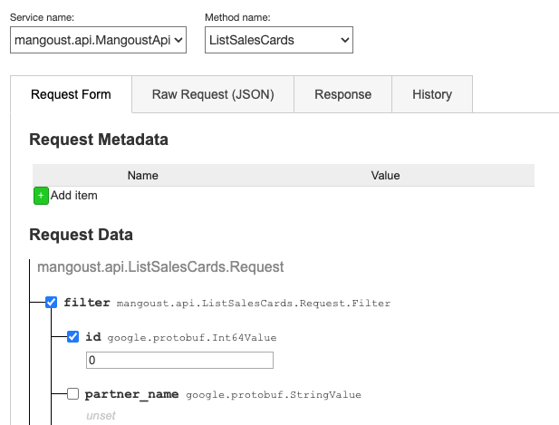

# grpcwebui-extension

## Установка плагина
1. Скачайте этот репозиторий [https://github.com/victorivanovspb/grpcwebui-extension/](https://github.com/victorivanovspb/grpcwebui-extension/).
2. Переключите свой браузер Chrome в режим разработчика на странице "Расширений" (chrome://extensions/)
3. Загрузите в браузер распакованное расширение (кнопка "Загрузить распакованное расширение" на странице "Расширений").
4. Включите плагин.
5. Перейдите на страницу с grpc-web-ui приложением (если в бэкстейдже, то нужно перейти на **standalone**-страницу апихи).
6. PROFIT

## Что нужно ещё улучшить (Whishlist)
* Common:  
  * [ ] 1.1. Поддержать 3-ю версию манифеста (manifest.json).
* Шапка:
  * [ ] 2.1. Рядом с Service name и Method name добавить возможность выбирать Namespace и Service в нем (слева) и указывать окружение dev/test/prod (справа).
* Request Form:
  * [ ] 3.1. Было бы удобно выбирать параметры кликом не только на сам чекбокс, но и на название параметра (чтобы сильно не целиться мышкой).
  * [ ] 3.2. BUG: Для енумок (repeated) чуть наслаивается текст про модель на кнопку "Add item".
  * [ ] 3.3. (на подумать) Указывать Request Timeout практичнее в секундах (как сейчас) или милисекундах?
* Raw Request:
  * [x] ~~4.1. Интерактивная json-валидация (простая).~~
  * [ ] 4.2. Нужна интерактивная json-валидация по схеме (json-schema).
  * [ ] 4.3. Убрать валидацию при переключении на другую вкладку (Request Form, Response и другие).
  * [ ] 4.4. Кнопки справа (plain, pretty, etc.) сделать больше по размеру (чтобы легче было попасть по ним).
  * [ ] 4.5. При раскрытии окна (plain) прикрутить управление с клавиатуры - по Esc закрывать форму; если хватит сил, можно вообще на все кнопки прикрутить быстрые клавиши (например, Ctrl+P (plain), Ctrl+B (beautify), Ctrl-C (copy) и т.д.); клик в сторону также мог бы закрывать раскрытую форму.
  * [ ] 4.6. Plain и Pretty можно объединить в одну кнопку (и одно общее действие), поскольку оба они раскрывают одну и ту же форму. Либо бьютифировать сразу в форме Raw Request, без раскрытия, либо просто убрать plain.
  * [ ] 4.7. В раскрытом окне (plain) можно тоже добавить кнопку "Copy".
  * [ ] 4.8. По нажатию на copy не выводить всплывающее окно, на котором еще дополнительно требуется нажимать OK, а уведомлять об успешном копировании каким-нибудь всплывающим уведомлением. Есть ощущение, что сделать Ctrl-A, Ctrl-C быстрее, чем сейчас вести мышью к copy, а потом к OK ).
  * [ ] 4.9. Сделать конвертирование camelCase в snake_case (например, для легкого копирования и вставки тела запроса в Postman).
* Response:
  * [ ] 5.1. Те же замечания, что и для Raw Request.
  * [x] ~~5.2. В раскрытом окне plain кнопка {collapse} написана в фигурных скобках.~~
* History: 
  * [ ] 6.1. Крестики для удаления записей расположить справа.
  * [ ] 6.2. Кнопку Clear History перенести тоже вправо (над крестиками).
  * [ ] 6.3. Выделять запрос, на который наведена мышь, цветом (например, серым).
  * [ ] 6.4. В раскрытом запросе добавить кнопку "Copy".

*За предложения по улучшению отдельная благодарность [Стрельцову Михаилу (QA)](https://github.com/stoksik).*
